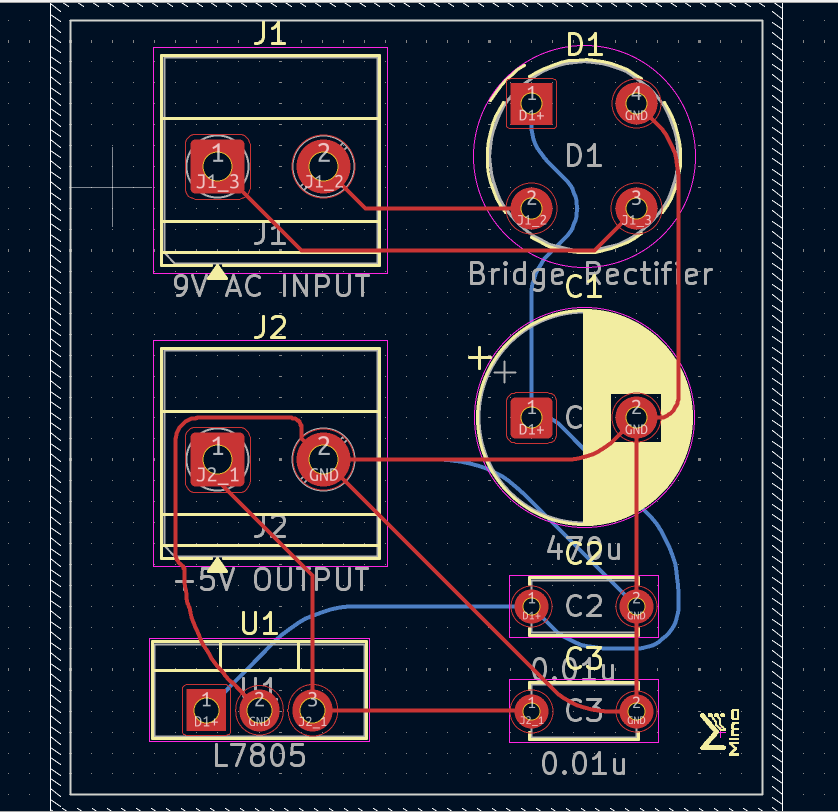
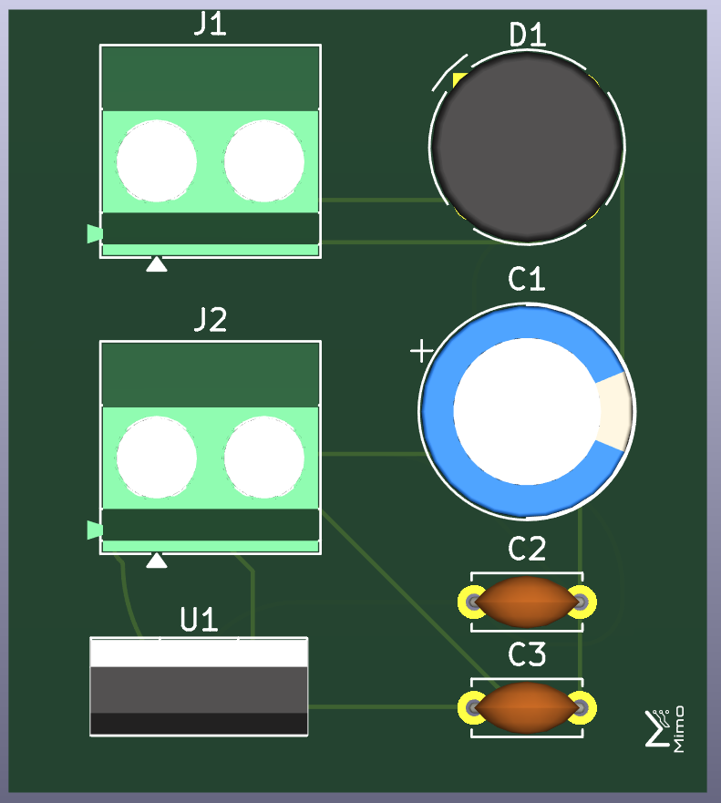
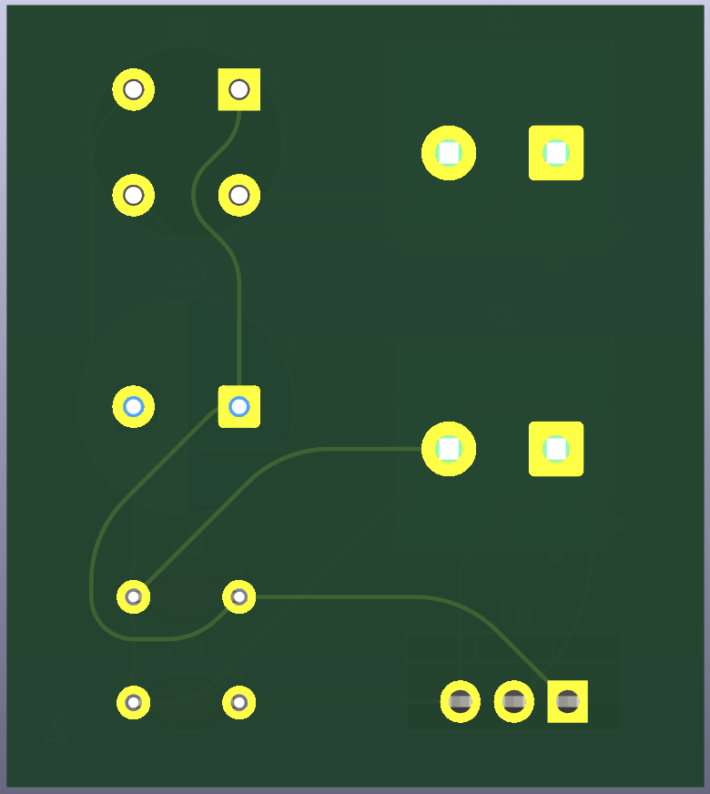
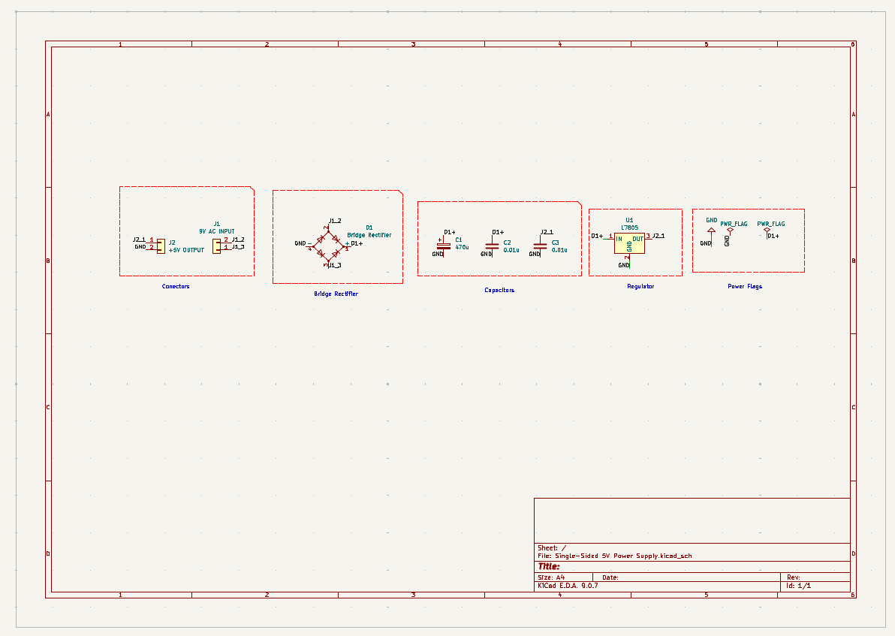

# Single-Sided 5V Power Supply

A compact **single-sided regulated 5V power supply** designed in **KiCad 9** as part of my PCB design learning journey.

This project was created to gain hands-on experience with the complete PCB design workflow—from schematic capture and PCB layout to design verification, 3D visualization, and manufacturing file generation.

---

# Project Preview

## PCB Layout



## 3D View (Front)



## 3D View (Back)



## Schematic




---

# About This Project

This project was built as part of my journey to learn PCB design using **KiCad 9**.

Rather than only creating a working circuit, I wanted to experience the complete engineering workflow used in PCB design. From creating the schematic to verifying the design using ERC and DRC, generating Gerber files, and organizing everything in a professional GitHub repository, this project helped me understand every stage involved in developing a PCB.

Although the circuit itself is relatively simple, the main goal was to gain practical experience with PCB design tools, best practices, and documentation.

---

# Project Overview

The circuit converts a DC input voltage into a regulated **5V output** using the **LM7805 voltage regulator**.

The board was designed as a **single-sided through-hole PCB**, making it suitable for beginners, hobbyists, and educational purposes.

During this project I learned how to:

- Create a schematic in KiCad
- Assign footprints to schematic symbols
- Design a PCB layout
- Route traces manually
- Create a ground copper pour
- Verify the design using ERC and DRC
- Inspect the PCB in the 3D Viewer
- Generate manufacturing-ready Gerber files
- Organize a PCB project for GitHub

---

# Features

1. Single-sided PCB design
2. Regulated 5V output using LM7805
3. Through-hole components
4. Manual component placement
5. Manual PCB routing
6. Ground copper pour
7. Power indicator LED
8. ERC verification
9. DRC verification
10. 3D PCB visualization
11. Manufacturing-ready Gerber files

---

# Specifications

| Parameter | Value |
|-----------|-------|
| Output Voltage | 5V DC |
| Voltage Regulator | LM7805 |
| PCB Type | Single-Sided |
| Mounting Style | Through-Hole (THT) |
| PCB Design Software | KiCad 9 |
| Routing | Manual |
| Ground Plane | Copper Pour |
| Manufacturing Files | Gerber |

---

# Components Used

| Component | Quantity | Purpose |
|-----------|:--------:|---------|
| LM7805 Voltage Regulator | 1 | Regulates the input voltage to a stable 5V output |
| 1000µF Electrolytic Capacitor | 1 | Smooths the input voltage and reduces ripple |
| 100µF Electrolytic Capacitor | 1 | Stabilizes the regulated output voltage |
| 100nF Ceramic Capacitor | 2 | Filters high-frequency noise |
| Bridge Rectifier| 1 | converts AC into DC using four or more diodes |
| 2-Pin Screw Terminal | 2 | Input and output power connections |

---

# Why These Components?

The **LM7805** is one of the most popular linear voltage regulators because it provides a reliable and stable 5V output with very little external circuitry.

The **electrolytic capacitors** help smooth voltage fluctuations on both the input and output sides of the regulator.

The **ceramic capacitors** filter high-frequency noise and improve regulator stability.

The **LED** together with the **330Ω resistor** provides a simple power-on indicator.

The **screw terminals** make it easy to connect an external power source and output load.

# Design Process

This project was completed by following the same workflow typically used when designing a PCB—from schematic creation to generating manufacturing files.

---

# 1. Schematic Design

The first step was creating the complete schematic in **KiCad 9**.

During this stage, I:

- Added all the required electronic components.
- Connected the components according to the circuit design.
- Added power symbols.
- Used net labels where appropriate to keep the schematic clean and easy to read.
- Verified that every connection matched the intended circuit.

Before moving to PCB design, I also assigned footprints to every schematic symbol so each component would have the correct physical package on the PCB.

This stage helped me understand the importance of creating a well-organized schematic before starting the PCB layout.

---

# 2. Footprint Assignment

After completing the schematic, I assigned footprints to all components.

Choosing the correct footprint is essential because it determines how the actual component will fit onto the PCB.

For this project I selected through-hole footprints that matched the physical components I planned to use, including:

- LM7805 (TO-220 package)
- Electrolytic capacitors
- Ceramic capacitors
- LED
- Resistors
- Screw terminals

Once every footprint was assigned correctly, I updated the PCB from the schematic.

---

# 3. Electrical Rules Check (ERC)

Before starting the PCB layout, I performed an **Electrical Rules Check (ERC)**.

ERC helped verify that the schematic was electrically correct by checking for common design mistakes.

During the ERC process, I checked for:

- Missing electrical connections
- Unconnected pins
- Incorrect power connections
- Missing power flags
- Electrical rule violations

Any reported issues were corrected before continuing.

Running ERC gave me confidence that the schematic was complete and ready for PCB layout.

---

# 4. PCB Layout

After completing the schematic and assigning footprints, I imported the design into the PCB Editor.

The first task was arranging all components in a logical position before routing.

While placing components, I focused on:

- Keeping related components close together.
- Minimizing trace lengths where possible.
- Creating a layout that would be easy to route.
- Leaving enough space between components for soldering and maintenance.

Good component placement significantly reduced routing complexity later in the design.

---

# 5. Manual Routing

Since this project is a **single-sided PCB**, all traces needed to be routed carefully on one copper layer.

Instead of relying on automatic routing, I manually routed every connection.

During routing I focused on:

- Keeping traces as short as practical.
- Avoiding unnecessary bends.
- Maintaining proper spacing between traces.
- Keeping the layout clean and organized.
- Making the routing easy to understand and manufacture.

This was one of the most challenging parts of the project because single-sided PCBs provide less routing flexibility than double-sided boards.

I had to reposition components several times before reaching a layout that balanced functionality and simplicity.

---

# 6. Ground Copper Pour

After routing all the traces, I created a **Ground (GND) Copper Pour**.

Using a copper pour provides several advantages:

- Better grounding throughout the PCB.
- Reduces unused copper areas.
- Improves overall board appearance.
- Can slightly improve heat dissipation.
- Helps simplify some ground connections.

After creating the copper pour, I refreshed the filled zones to ensure every ground connection was properly connected.

---

# 7. Design Rules Check (DRC)

Once the PCB layout was complete, I ran **Design Rules Check (DRC)**.

Unlike ERC, which checks the schematic, DRC verifies the physical PCB layout.

The DRC checked for:

- Trace clearance violations.
- Minimum spacing between pads.
- Track width violations.
- Overlapping footprints.
- Board outline errors.
- Manufacturing rule violations.

Any reported errors or warnings were reviewed and corrected before generating manufacturing files.

Running DRC ensured the PCB design was suitable for fabrication.

---

# 8. 3D Verification

Before generating the manufacturing files, I inspected the PCB using KiCad's **3D Viewer**.

The 3D Viewer allowed me to verify:

- Component orientation.
- Component placement.
- Overall board appearance.
- Silkscreen positioning.
- General mechanical fit.

Viewing the board in 3D helped identify issues that might not be obvious in the 2D PCB editor.

---

# 9. Gerber Generation

The final stage of the project was generating the manufacturing files required for PCB fabrication.

The generated files include:

1. Top Copper Layer
2. Bottom Copper Layer
3. Top Solder Mask
4. Bottom Solder Mask
5. Top Silkscreen
6. Bottom Silkscreen
7. Edge Cuts
8. Drill Files
9. Gerber Job File

These files are included in the **gerbers/** directory and are ready to be sent to a PCB manufacturer.

Completing this step helped me understand how PCB manufacturers use Gerber files to fabricate a finished circuit board.

---# Repository Structure

The project is organized to keep the design files, documentation, and manufacturing files separated for easy navigation.

```text
Single-Sided-5V-Power-Supply/
│
├── docs/
│   ├── schematic.svg
│   ├── pcb-layout.png
│   ├── pcb-3d-front.png
│   └── pcb-3d-back.png
│
├── gerbers/
│   ├── *.gbr
│   ├── *.drl
│   └── *.gbrjob
│
├── LICENSE
├── README.md
├── .gitignore
│
├── Single-Sided 5V Power Supply.kicad_pro
├── Single-Sided 5V Power Supply.kicad_sch
└── Single-Sided 5V Power Supply.kicad_pcb
```

---

# Challenges & Lessons Learned

Every project presents new challenges, and this one was no exception. While the circuit itself is straightforward, designing the PCB and understanding the complete workflow taught me many valuable lessons.

## Challenges

### 1. Learning the KiCad Workflow

One of the biggest challenges was understanding how each stage of the design process connects together. I learned that a successful PCB project starts with a well-organized schematic before moving on to PCB layout.

---

### 2. Component Placement

Finding a clean placement for every component took several iterations.

I discovered that spending extra time arranging components before routing makes the PCB much easier to design and results in a cleaner final layout.

---

### 3. Routing a Single-Sided PCB

Routing every connection on only one copper layer was the most challenging part of the project.

To complete the routing successfully, I had to move components multiple times and rethink the layout until every connection could be made cleanly.

This taught me the importance of planning before routing.

---

### 4. Understanding ERC and DRC

At first I didn't fully understand why KiCad provided both ERC and DRC.

While working on this project, I learned that:

- **ERC** verifies the electrical correctness of the schematic.
- **DRC** verifies the physical correctness of the PCB layout.

Both checks are essential before manufacturing a PCB.

---

### 5. Organizing a GitHub Repository

This project also taught me how to organize a hardware project professionally.

I learned how to:

- Structure folders
- Document the project
- Generate manufacturing files
- Add project images
- Use Git and GitHub to manage revisions

---

# Lessons Learned

Working on this project helped me gain practical experience with:

- Creating electronic schematics in KiCad
- Assigning component footprints
- Updating the PCB from the schematic
- Component placement strategies
- Manual PCB routing
- Designing a single-sided PCB
- Using copper pours for grounding
- Running ERC to verify the schematic
- Running DRC to verify the PCB layout
- Inspecting the board using KiCad's 3D Viewer
- Generating Gerber files for PCB manufacturing
- Organizing a professional hardware project on GitHub

One of the biggest lessons I learned is that PCB design is an iterative process.

Creating a reliable PCB is not only about making the circuit work—it also requires careful planning, verification, problem-solving, and continuous improvements throughout the design process.

---

# Future Improvements

Although the project meets its intended objectives, there are several improvements I would like to explore in future versions.

1. Add reverse polarity protection.
2. Add an input fuse for additional safety.
3. Add a power switch.
4. Improve silkscreen labels for easier assembly.
5. Optimize trace widths for higher current capability.
6. Design a double-sided version of the PCB.
7. Add mounting holes for easier enclosure installation.
8. Improve the overall board layout for a more compact design.

---

# Skills Demonstrated

This project allowed me to practice and improve the following skills:

- PCB Design
- Schematic Capture
- Electronic Component Selection
- Footprint Assignment
- Manual PCB Routing
- Copper Pour Design
- ERC Verification
- DRC Verification
- 3D PCB Inspection
- Gerber File Generation
- KiCad 9
- Git
- GitHub
- Technical Documentation

---

# Tools Used

| Tool | Purpose |
|------|---------|
| KiCad 9 | Schematic Capture and PCB Design |
| Git | Version Control |
| GitHub | Project Hosting and Documentation |

---

# Acknowledgements

This project was completed as part of my PCB design learning journey.

It provided valuable hands-on experience with the complete PCB design workflow, from schematic creation to manufacturing file generation. Beyond designing the circuit, it helped me understand the importance of verification, organization, and documentation in hardware development.

I plan to continue building more PCB projects to further improve my skills in electronics and PCB design.

---

# License

This project is licensed under the **MIT License**.

See the **LICENSE** file for more details.
